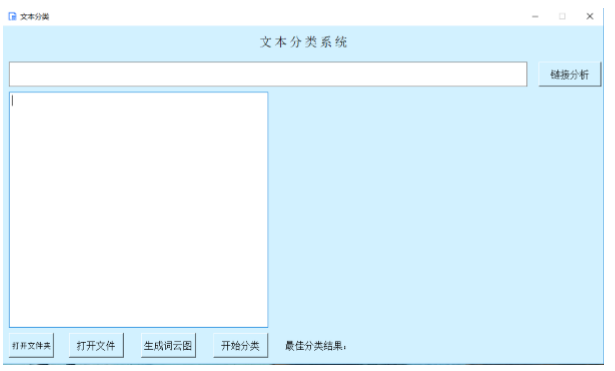
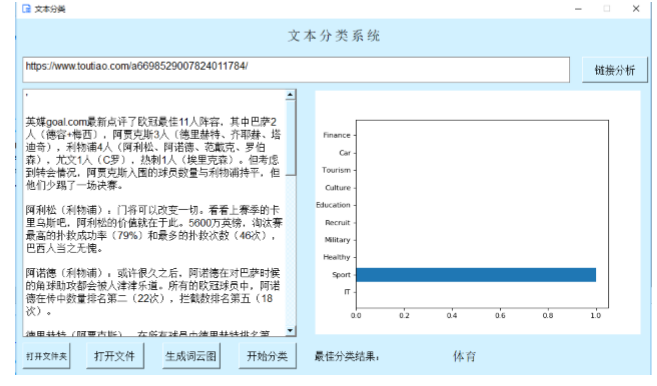
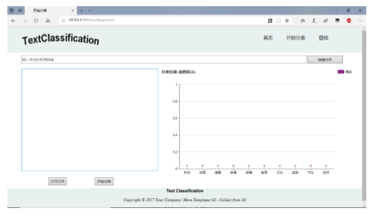
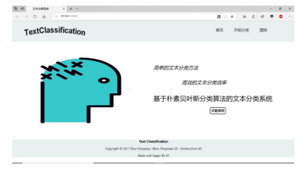
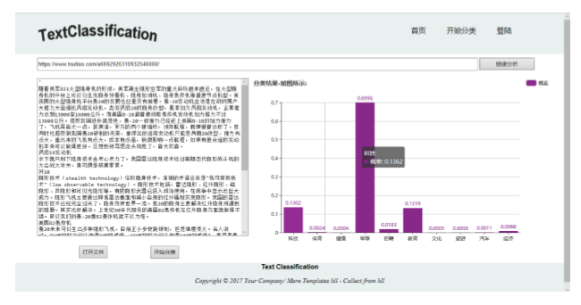

# 系统介绍：

该系统是一个基于朴素贝叶斯算法的文本分类系统，该系统主要功能是将输入的文本进行分类处理。但在实际处理中该系统能实现输入特定文本分类，打开特定文本文件进行分类，输入特定新闻链接将链接内容进行分类，对特定文件夹下的文本文件进行分类并将分类结果保存在特定的result文件夹中,生成词云图，分类结果以图表展示。在该系统中为了方便大家的使用，主要设计了桌面端和web端。桌面端基于PYQT5开发桌面应用，桌面端系统的功能要多于web端系统，主要有生成词云图，对文件夹中文本分类。web端主要是基于Mydjango后端框架开发的web系统，将分类功能设置为应用接口，方便前后端的调用处理。该系统的所有开发任务都是在PyCharm中完成的。关于如何创建Django项目和QT项目请自觉百度或者google。以下进行些开发说明。

**ps：QT和Mydjango最好放在同一文件夹，在Pycharm中设置该文件夹为sources root**

## 桌面端：

在QT文件夹中主要包含PYQT5开发的所有代码内容。

对开发环境和数据说明：

对未安装的包自觉导入即可。在https://github.com/HappyShadowWalker/ChineseTextClassify/tree/master/SogouC 中下载即可。（修改好对应代码名字，将ClassFile中修改好的内容直接复制在QT文件夹中Trian_Data中即可）。

界面效果图如下：

分类结果图如下（之一）：

## web端

在Mydjango文件夹下主要包含web端所有的静态资源文件和后端接口代码。

对开发环境和数据说明：

该文件与能直接运行的django项目只差一个venv环境。在新建一个django项目（最好名为Mydjango）后会自动生成要给venv环境，所以我们直接将该Mydjango的所有内容复制进入该创建好的项目中即可运行。

主要界面效果图如下：

分类界面效果图：

分类结果效果图（之一）：

